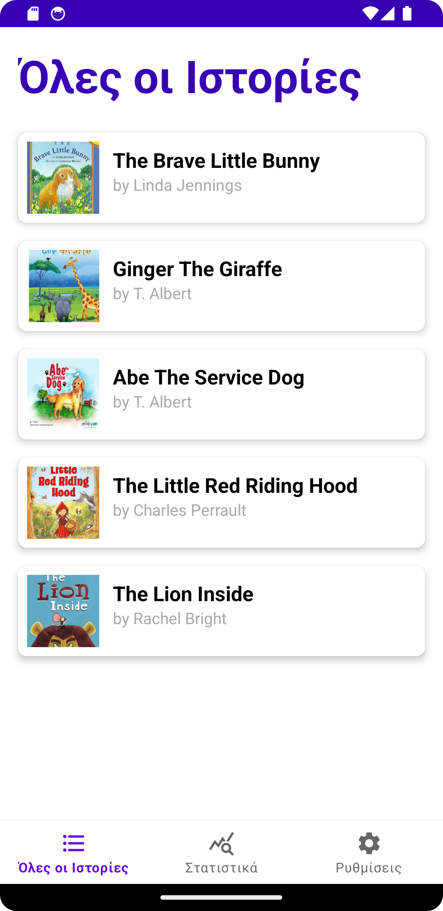
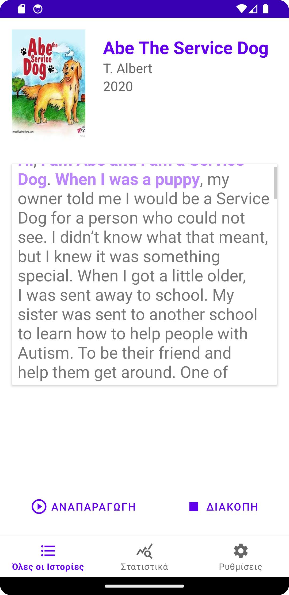
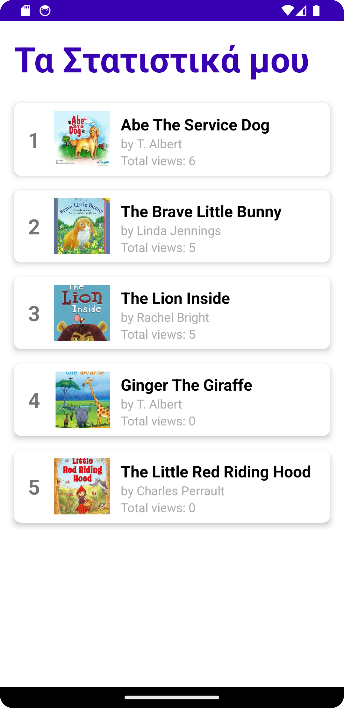

# Unipi Audio Stories
Android application for reading children stories

## Description
Unipi Audio Stories is a thoughtfully crafted Android application designed to provide an engaging and educational platform for children to explore and enjoy stories. The app allows users to read stories, listen to audio narrations, and interact with their favorite tales, all while keeping track of personal preferences and statistics.
## Workflows
### 1. Viewing a List of Stories
Upon launching the application, users are greeted with a neatly arranged list of available stories.
Each story in the list displays its title, author, and an accompanying cover image fetched from Firebase Storage.
The story list is dynamically populated from Firestore, ensuring real-time updates whenever new stories are added or updated.
### 2. Selecting a Story
Users can select a story from the list, which navigates them to the Story Detail screen.
The app uses intuitive navigation to transition between fragments, ensuring a smooth user experience.
### 3. Reading and Listening to a Story
On the Story Detail screen, users can:
- View the full story text.
- Listen to the story narrated dynamically using the TextToSpeech (TTS) class.
- Control playback with dedicated play and stop buttons.
- Since there are no pre-recorded audio files, the narration is entirely powered by TextToSpeech, ensuring the app is lightweight and flexible.
- The interface is designed to be accessible and kid-friendly, with large buttons and a clean layout.
### 4. Statistics Tracking
The application keeps detailed statistics of user interactions, including:
The number of times a story has been viewed.
The most frequently played stories.
Statistics are stored in SharedPreferences for local tracking, providing users with instant feedback on their app usage.
The Statistics Activity presents this information visually, using a carousel view to showcase the most played stories with their cover images.

## Technologies Used
### Firestore
- Stories and their metadata (titles, authors, and text) are stored in Firestore.
- Firestore ensures the app remains up-to-date with the latest stories without requiring manual updates or redeployment.

#### Document example:
```json
"JgK1qCJhcpghPqoHROXi": 
    {
        "author": "Linda Jennings",
        "title": "The Brave Little Bunny",
        "year": 1995,
        "text": "A lop-eared bunny unexpectedly gets her wish, but encounters hungry predators and fierce, wild rabbits that make her choose between freedom and safety.",
        "imageUrl": "https://firebasestorage.googleapis.com/v0/b/unipi-audio-stories-e6c3f.firebasestorage.app/o/images%2Fthe_brave_little_bunny.jpeg?alt=media&token=9bc6e608-efee-411f-9953-1919135948c8"
    }
```
### Firebase Storage
- Images and audio files for each story are stored in Firebase Storage.
- Firebase Storage allows efficient and scalable delivery of media assets, ensuring smooth playback and fast image loading.
### SharedPreferences
Local storage is used to save:
- Story view counts

This ensures quick and offline access to user-specific data, enhancing the app's reliability.

### TextToSpeech
- The TextToSpeech (TTS) class is utilized to dynamically narrate story text.
- Since the app does not use any pre-recorded audio files, the TTS engine generates speech in real-time from the story text stored in the database.
- The TTS feature supports multiple languages (English, Spanish, French, and Greek), enhancing accessibility for a diverse audience.

## Images



